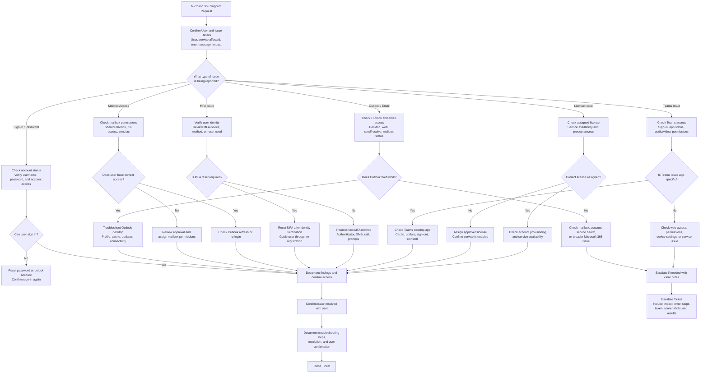

# Microsoft 365 Support Workflow

## Purpose

This diagram shows a professional Microsoft 365 support workflow for common help desk issues such as sign-in problems, password resets, Outlook issues, mailbox access, MFA problems, Teams support, and licensing checks.

## What This Workflow Demonstrates

- Microsoft 365 help desk workflow
- Sign-in and password troubleshooting
- Outlook and email troubleshooting
- Shared mailbox access support
- MFA support and reset process
- Microsoft Teams support
- Licensing checks
- Ticket escalation and documentation

## Common Microsoft 365 Support Scenarios

| Scenario | Example Support Action |
|---|---|
| User cannot sign in | Check account status, reset password, confirm MFA |
| Outlook not working | Test Outlook web, rebuild profile, review mailbox |
| Shared mailbox missing | Check permissions and Outlook refresh |
| MFA prompts not working | Verify identity and reset MFA if needed |
| Teams audio/video issue | Check device settings, Teams app, permissions |
| Missing app access | Check assigned license and enabled services |

## Example Support Notes

When documenting a Microsoft 365 issue, include:

- User impact
- Service affected
- Error message
- Troubleshooting completed
- Whether issue affects one user or multiple users
- Account or license checks completed
- Resolution provided
- User confirmation
- Escalation details if unresolved

## Portfolio Note

This workflow is part of a Microsoft 365 Admin Lab designed to demonstrate practical IT Support, Service Desk, Desktop Support, and Junior Systems Administrator documentation skills.
