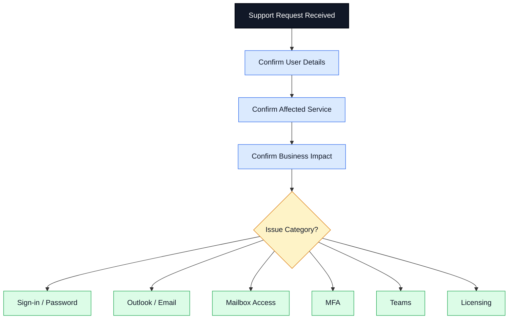
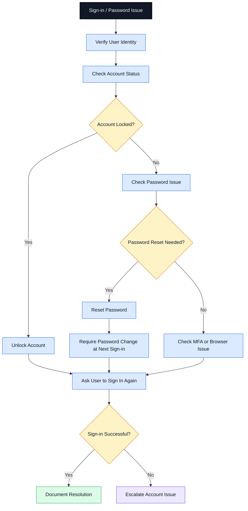
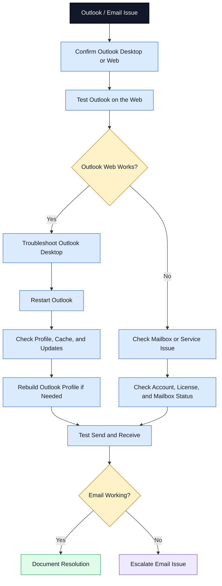
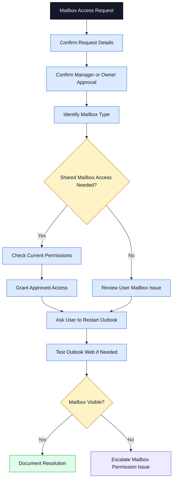
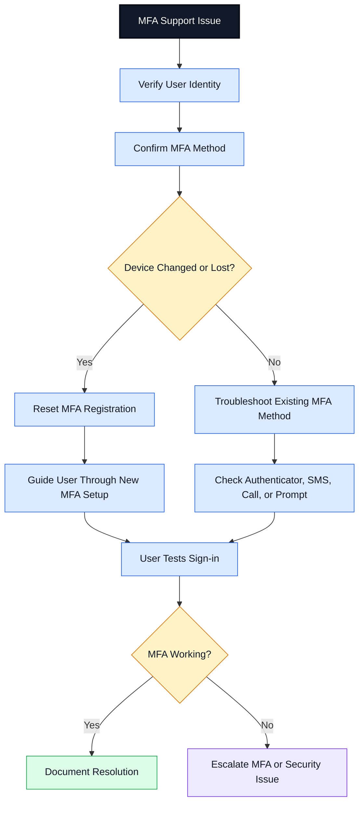
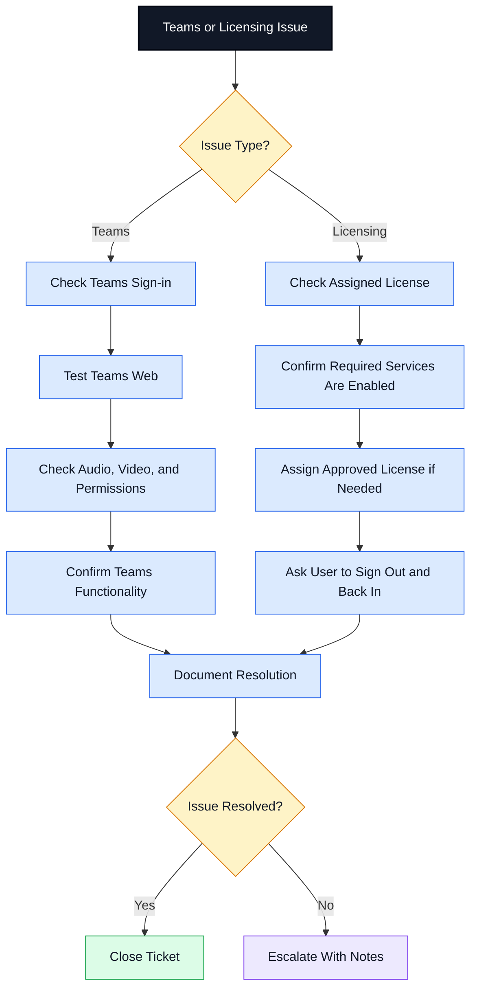
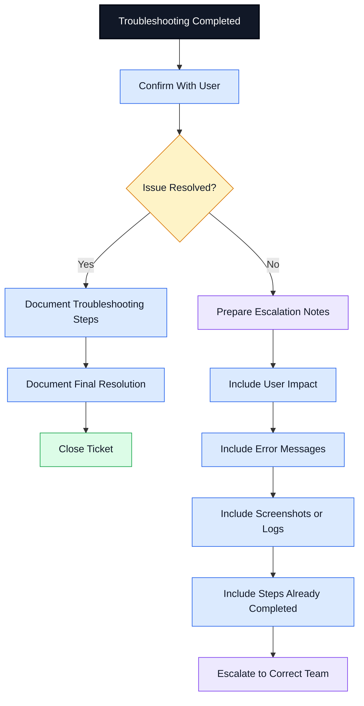

# Microsoft 365 Support Workflow

## Purpose

This document shows a professional Microsoft 365 help desk and admin support workflow. It is separated into smaller readable diagrams so it displays clearly on GitHub without needing to zoom in.

---

# 1. Microsoft 365 Support Intake Workflow

## Intake Notes

During intake, the support technician should confirm:

* User name
* Contact method
* Affected Microsoft 365 service
* Error message
* Time issue started
* Business impact
* Whether one user or multiple users are affected

---

# 2. Sign-in and Password Support Workflow

## Common Sign-in Issues

| Issue                | Support Action                              |
| -------------------- | ------------------------------------------- |
| User forgot password | Verify identity and reset password          |
| Account locked       | Unlock account and check cause              |
| Password expired     | Reset password or guide user through update |
| Browser issue        | Test private window or clear cache          |
| MFA blocking sign-in | Review MFA workflow                         |

---

# 3. Outlook and Email Support Workflow

## Common Outlook Issues

| Issue                    | Support Action                             |
| ------------------------ | ------------------------------------------ |
| Outlook not opening      | Restart Outlook or rebuild profile         |
| Mail not syncing         | Test Outlook Web and check profile         |
| Repeated password prompt | Check password, MFA, and saved credentials |
| Email not sending        | Check mailbox, network, and Outlook status |
| Search not working       | Check Outlook profile and indexing         |

---

# 4. Mailbox Access Workflow

## Mailbox Access Notes

| Access Type    | Meaning                                   |
| -------------- | ----------------------------------------- |
| Full Access    | User can open and manage mailbox content  |
| Send As        | User can send email as the shared mailbox |
| Send on Behalf | User can send on behalf of the mailbox    |

---

# 5. MFA Support Workflow

## MFA Security Notes

* Always verify identity before resetting MFA.
* Escalate suspicious MFA requests.
* Watch for unexpected MFA prompts.
* Do not approve MFA resets based only on an email request.
* Document all MFA changes in the ticket.

---

# 6. Teams and Licensing Support Workflow

## Common Teams and Licensing Issues

| Issue                    | Support Action                                 |
| ------------------------ | ---------------------------------------------- |
| Teams will not open      | Test Teams Web and restart app                 |
| Microphone not working   | Check device settings and Teams permissions    |
| User missing Office apps | Check assigned Microsoft 365 license           |
| User cannot access Teams | Confirm license and Teams service availability |
| User cannot install apps | Check license and install permissions          |

---

# 7. Ticket Closure and Escalation Workflow

## Escalation Notes to Include

When escalating a Microsoft 365 ticket, include:

* User impact
* Affected service
* Error message
* Screenshots if available
* Troubleshooting already completed
* Whether the issue affects one user or multiple users
* Account status
* License status
* MFA status if related
* Outlook Web test result if email-related
* Recommended next step

---

# Common Microsoft 365 Support Scenarios

| Scenario                       | First Support Area to Check                  |
| ------------------------------ | -------------------------------------------- |
| User cannot sign in            | Account status, password, MFA                |
| Outlook not syncing            | Outlook Web, desktop profile, mailbox status |
| Shared mailbox missing         | Permissions and Outlook refresh              |
| MFA device changed             | Identity verification and MFA reset          |
| Teams audio/video issue        | Teams settings and device permissions        |
| User missing app access        | License assignment and enabled services      |
| Email not sending              | Outlook, mailbox, service health, network    |
| User receives repeated prompts | Password, MFA, saved credentials             |

---

# Portfolio Note

This workflow is part of a Microsoft 365 Admin Lab designed to demonstrate IT Support, Service Desk, Desktop Support, Technical Support, and Junior Systems Administrator documentation skills.

## Disclaimer

This is a learning and documentation lab. It does not contain real tenant information, real user data, passwords, credentials, or private company information.
